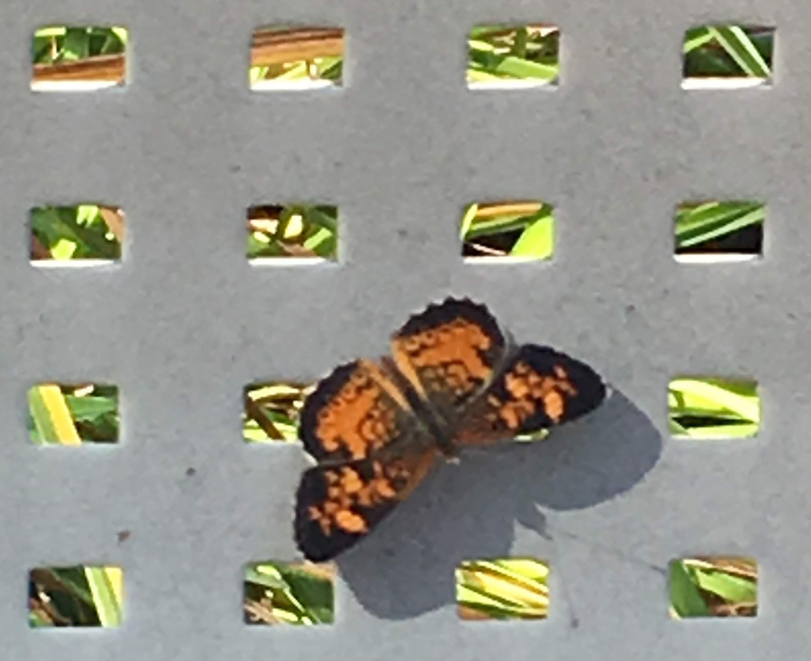

## Colab books of [Dr. Joshua Stough](http://joshuastough.com), Bucknell University

- [Python Structures (CS2)](https://joshuastough.github.io/pythonstructures/)  

- [Image Processing](https://joshuastough.github.io/imageprocessing/)  

If you like what you see, please [let me know](mailto:joshua.stough@gmail.com) or 
[buy me a coffee](https://www.buymeacoffee.com/joshuastough).

 

    

